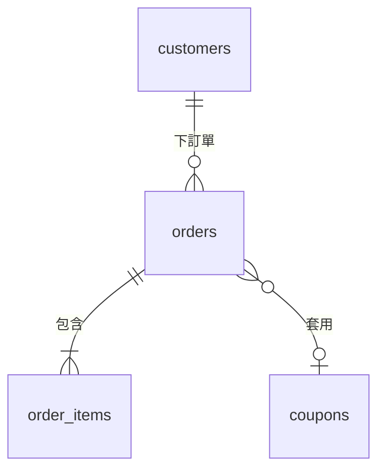

# 輸出文件模板

schema 是單一檔案 `docs/db/schema.md`。段落順序固定；沒有內容的段落寫「無」而不是刪掉。所有「來源」欄寫模型位置（`order.md#Order.status`）、規則 ID（`<slug>/BR-XXX-nnn`）或「儲存衍生」。

```markdown
# Database Schema — <專案名>

> 最後更新：YYYY-MM-DD ｜ 引擎：PostgreSQL 16 ｜ 對應模型：docs/domain/model/（README v3） ｜ 狀態：草稿 / 已確認

## 範圍與來源
- **來源模型**：`docs/domain/model/`——README.md、order.md、customer.md、shared.md（各檔最後更新日）
- **涵蓋**：table / 欄位 / 鍵 / 索引 / 約束 / 不變量落點 / 遷移順序
- **不涵蓋**：migration 檔、ORM 定義、API 型別、查詢調校
- **模型與 schema 的關係**：模型改了才改 schema；schema 為效能做的取捨不回頭改模型

## 命名與通用慣例
<從 conventions.md 挑定的那一套，逐條寫明：命名、主鍵策略、時間、金額、軟刪除、多租戶、並行控制、慣例欄位>

| 項目 | 本專案採用 | 說明 |
|---|---|---|
| 命名 | snake_case / table 複數 | — |
| 主鍵 | UUIDv7（`id`） | 應用層產生，時間有序 |
| 時間 | `timestamptz`，UTC 儲存 | 業務時區 Asia/Taipei，切日在應用層 |
| 金額 | 整數最小單位 + 幣別欄位 | `*_amount_minor`、`*_currency` |
| 刪除 | 硬刪 | 例外見各表 |
| 慣例欄位 | `id`、`created_at`、`updated_at`、`version` | 標「儲存衍生」，不再逐表重述 |

## ER 圖



## Table 一覽
| Table | 對應模型元素 | 聚合 / 交易邊界 | 說明 |
|---|---|---|---|
| `orders` | Order（聚合根，order.md） | 訂單（與 `order_items` 同交易） | — |
| `order_items` | OrderItem（值物件集合，order.md） | 訂單 | — |
| `order_outbox` | 儲存衍生 | 訂單 | OrderSubmitted 的可靠送達 |

## Table 定義

### `orders`
- **對應**：`order.md#Order`（聚合根）
- **交易邊界**：與 `order_items`、`order_outbox` 同交易寫入

| 欄位 | 型別 | NULL | 預設 | 說明 | 來源 |
|---|---|---|---|---|---|
| `id` | `uuid` | NOT NULL | — | 主鍵 | 儲存衍生 |
| `customer_id` | `uuid` | NOT NULL | — | 下單客戶 | order.md#Order.customerId |
| `status` | `text` | NOT NULL | `'draft'` | 見「列舉落地」 | order.md#OrderStatus |
| `total_amount_minor` | `bigint` | NOT NULL | — | 成立時凍結 | order-dedup/BR-ORD-010 |
| `total_currency` | `char(3)` | NOT NULL | `'TWD'` | ISO 4217 | shared.md#Money |
| `coupon_id` | `uuid` | NULL | — | NULL = 未使用優惠券 | order.md#Order.couponId |
| `version` | `integer` | NOT NULL | `0` | 樂觀鎖 | 儲存衍生 |
| `created_at` | `timestamptz` | NOT NULL | `now()` | — | 儲存衍生 |

- **主鍵**：`id`
- **外鍵**：
  | 約束 | 欄位 → 參照 | ON DELETE | 跨聚合 | 來源 |
  |---|---|---|---|---|
  | `fk_orders_customer_id` | `customer_id` → `customers.id` | `RESTRICT` | 是 | order.md#客戶—訂單 |
- **唯一**：`uq_orders_number`（`number`）— INV-ORD-009
- **CHECK**：
  | 約束 | 條件 | 來源 |
  |---|---|---|
  | `ck_orders_status` | `status IN (…)` | order.md#OrderStatus |
  | `ck_orders_total_non_negative` | `total_amount_minor >= 0` | INV-SHR-001 |
- **索引**：見「索引總表」
- **備註**：<軟刪除、分割、保留期限等，無則省略>

### `order_items`
<同格式>

## 列舉落地
| 模型列舉 | 落地方式 | 欄位 | 值 | 來源 |
|---|---|---|---|---|
| OrderStatus | `text` + CHECK | `orders.status` | `draft`, `submitted`, `cancelled` | order.md#OrderStatus |

值的字面字串與模型識別名的對應規則寫一次（PascalCase → snake_case），不逐個解釋。

## 關聯落點
模型每條關聯都要在這裡有一列。

| 模型關聯 | 基數 | 落地 | NULL | ON DELETE | 來源 |
|---|---|---|---|---|---|
| 客戶下訂單 | 1 → 0..* | `orders.customer_id` 外鍵 | NOT NULL | RESTRICT | order.md |
| 訂單包含項目 | 1 → 1..50 | `order_items.order_id` 外鍵 + 應用層守上限 | NOT NULL | CASCADE | order.md |

## 不變量落點
模型每條 INV / POL 都要在這裡有一列，落點不得為「無」。

| ID | 陳述摘要 | 落點 | 實作 | 檢查時機 | 違反時 |
|---|---|---|---|---|---|
| INV-ORD-006 | quantity 1..99 | DB | `ck_order_items_quantity_range` | 寫入時 | 拒絕 |
| INV-ORD-001 | 項目數 1..50 | 應用層 | 交易內 COUNT + 鎖 `orders` 該列 | CreateOrder / AddOrderItem | 拒絕 |
| INV-CUS-002 | 同客戶最多 5 張進行中訂單 | 應用層 | 交易內查詢 + 樂觀鎖 | CreateOrder | 拒絕 |
| POL-ORD-002 | 送出後通知 | 應用層 | `order_outbox` + worker 重試 | OrderSubmitted 之後 | 重試，不影響主交易 |

## 索引總表
| 索引 | Table | 欄位（順序） | 類型 | 支援的命令 / 查詢 | 來源 |
|---|---|---|---|---|---|
| `uq_orders_number` | `orders` | `number` | UNIQUE | 依訂單編號查詢 | INV-ORD-009 |
| `idx_orders_customer_status` | `orders` | `customer_id`, `status` | B-tree | CreateOrder 的進行中訂單數檢查 | INV-CUS-002 |
| `idx_order_outbox_pending` | `order_outbox` | `created_at` | 部分（`WHERE sent_at IS NULL`） | outbox worker 撈未送出 | 儲存衍生 |

## 並行與交易
| 情境 | 競爭的命令 | 策略 | 隔離級別 |
|---|---|---|---|
| 同客戶同時下單 | CreateOrder × N | 交易內鎖 `customers` 該列 | Read Committed |
| 訂單狀態轉換 | SubmitOrder / CancelOrder | 樂觀鎖 `orders.version` | Read Committed |

## 儲存衍生物件
模型沒有、但儲存需要的表與欄位，各寫一句「為什麼非加不可」。

| 物件 | 用途 | 為什麼不在模型 |
|---|---|---|
| `order_outbox` | 領域事件可靠送達 | 屬於傳遞機制，模型只說「要發生什麼」 |
| `version` 欄位 | 樂觀鎖 | 並行控制是儲存層問題 |

## 未落地的模型元素
| 模型元素 | 原因 |
|---|---|
| POL-ORD-003 | 純外部通知格式，不需儲存 |

## 模型回饋
<設計過程中發現的模型矛盾或缺口；無則寫「無」。每條寫：模型位置、問題、建議>

## 遷移順序
1. `customers`
2. `coupons`
3. `orders`（依賴 1、2）
4. `order_items`、`order_outbox`（依賴 3）
5. 索引：`idx_orders_customer_status`、…

### 破壞性變更
| 變更 | 影響 | 需要回填 | 需要停機 | 回滾 |
|---|---|---|---|---|
| `orders.total` 改為 `total_amount_minor` | 既有列 | 是（× 100） | 否（三步式） | 保留舊欄位一個版本 |

## 假設與未決事項
| ID / 對象 | 假設 | 若不成立 | 涉及模型 / 規則 |
|---|---|---|---|
| `order_items` | 開獨立表而非 JSON | 改 JSON 需回填並放棄 CHECK | order.md#OrderItem |

- [ ] <未決事項>

## 變更紀錄
| 日期 | 對應模型版本 | 變更 |
|---|---|---|
| YYYY-MM-DD | README v2 | 初版：orders、order_items、customers |
| YYYY-MM-DD | README v3 | 新增 coupons、`orders.coupon_id`、INV-ORD-005 落點 |
```

## 文件型資料庫的差異

引擎是 MongoDB 時，把「Table 一覽 / Table 定義 / 列舉落地」換成：

- **Collection 一覽**：collection / 對應聚合 / document 大小預估 / 說明
- **Document 結構**：欄位 / 型別 / 必填 / 內嵌或參照 / 來源；內嵌子文件往下縮排一層
- **Validator**：每個 collection 的 JSON Schema 覆蓋哪些不變量

其餘段落（不變量落點、索引總表、並行、遷移順序、變更紀錄）照舊。

## 對話中的摘要格式

```
來源模型：docs/domain/model/（README v3，聚合 4）
引擎：PostgreSQL 16
寫入：docs/db/schema.md（新增 coupons、orders.coupon_id、2 條索引）
規模：table a ／ 欄位 b ／ 外鍵 c ／ 唯一 d ／ CHECK e ／ 索引 f
不變量落點：DB g 條 ／ 應用層 h 條 ／ 未落地 i 條（原因見文件）
追溯：模型元素 N 個全部有落點 ／ 未落地 K 個
最值得確認的三個設計假設：
1. <對象>：…（<模型位置 / BR ID>）
2. …
3. …
破壞性變更：<有的話逐條列出，無則「無」>
模型回饋：<有的話列出，建議回 /domain:model 處理>
下一步：/db:migrate 依本文件產生 migration 與 ORM schema；模型再變動就重跑 /db:schema 做增量更新。
```
