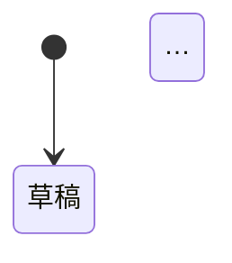

# 輸出文件模板

寫入 `docs/domain/business-rules/<slug>.md`。段落順序固定；沒有內容的段落寫「無」而不是刪掉，讓讀者知道是確認過而非遺漏。

```markdown
# Business Rules — <功能名>

> 產生日期：YYYY-MM-DD ｜ 版本：1 ｜ 狀態：草稿 / 已確認

## 問題與目標
<一段話：要解決什麼問題、功能做到什麼算成功。直接引用使用者原話為主，不擴寫。>

## 範圍
- **包含**：…
- **不包含**：…（使用者沒提、你也刻意不推導的東西）

## 領域拆解

| 面向 | 內容 |
|---|---|
| 參與者 | … |
| 實體 | … |
| 事件 / 動作 | … |
| 狀態 | … |

### 縮寫表
| 縮寫 | 實體 |
|---|---|
| ORD | 訂單 |

### 名詞定義
<類別 1 的規則放這裡，每條用標準格式>

## 狀態流轉（有生命週期時才有）



| 從 | 到 | 觸發者 | 條件 | 規則 |
|---|---|---|---|---|

## 權限矩陣（有多角色時才有）

| 動作 | 買家 | 客服 | 管理員 |
|---|---|---|---|
| 建立訂單 | ✓ | ✓（BR-ORD-004） | ✓ |

## 規則

依實體分組，組內依 ID 排序。每條用 `writing-rules.md` 的標準格式。

### 訂單（ORD）
#### BR-ORD-001 …
#### BR-ORD-002 …

### <下一個實體>

## 假設清單
<所有「來源：假設」的規則集中列一次，方便一眼掃過。每列一行：ID ｜ 假設內容 ｜ 若不成立的替代方案>

| ID | 假設 | 若不成立 |
|---|---|---|
| BR-ORD-003 | 時間窗為 5 分鐘滑動窗口 | 改為固定區間需重寫範例 |

## 規則間的優先序
<有衝突可能的規則對，每對一行；無則寫「無」>

## 與既有規則的關係
<repo 已有 business rules 或 schema 時：沿用了什麼、修改了什麼、衝突處理；無則寫「無既有規則」>

## 未決事項
- [ ] <寫不出驗證範例的願望、需要業務方拍板的事>

## 實作提示
<與規則分開的技術對應，給 AI agent 用：每條規則建議在哪一層驗證（輸入驗證 / 服務層 / 資料庫約束）、需要的索引或唯一鍵、需要的排程、建議的測試檔對應（一條規則至少一個測試案例，範例表即測試案例）。有 docs/tech-stack.md 時依其技術棧具體化。>

## 變更紀錄
| 日期 | 版本 | 變更 |
|---|---|---|
| YYYY-MM-DD | 1 | 初版 |
```

## 對話中的摘要格式

文件寫完後，在對話中輸出：

```
已寫入 docs/domain/business-rules/<slug>.md
規則 N 條：定義 a ／ 約束 b ／ 計算 c ／ 狀態 d ／ 權限 e ／ 時間 f ／ 觸發 g ／ 例外 h
假設 M 條，最值得確認的三個：
1. BR-XXX-nnn …
2. …
3. …
未決事項 K 項。
```
