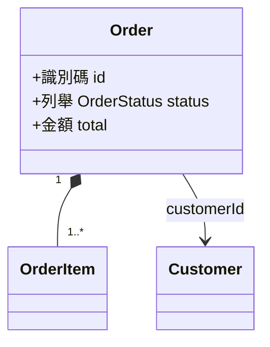

# 輸出文件模板

寫入 `docs/domain/<slug>-model.md`。段落順序固定；沒有內容的段落寫「無」而不是刪掉。

```markdown
# Domain Model — <功能名>

> 產生日期：YYYY-MM-DD ｜ 版本：1 ｜ 來源規則：`docs/domain/<slug>.md` 版本 N ｜ 狀態：草稿 / 已確認

## 範圍
- **本模型涵蓋**：<聚合名稱列表>
- **不涵蓋**：儲存方式、table / 欄位設計、索引、API 型別（見規則文件「實作提示」）

## 模型總覽



| 聚合 | 聚合根 | 包含 | 守的不變量 |
|---|---|---|---|
| 訂單 | Order | OrderItem | INV-ORD-001, INV-ORD-002 |

## 列舉

### 訂單狀態 OrderStatus
| 值 | 識別名 | 說明 | 終態 | 來源 |
|---|---|---|---|---|
| 草稿 | Draft | … | 否 | BR-ORD-005 |

### <下一個列舉>

## 值物件

### 金額 Money
- **定義**：…
- **屬性**：
  | 屬性 | 型別 | 說明 |
  |---|---|---|
  | amount | 小數（2 位） | … |
  | currency | 列舉 Currency | … |
- **相等性**：amount 與 currency 皆相同
- **不變量**：
  - INV-MON-001 amount ≥ 0（BR-ORD-010）
- **運算**：add、multiply（四捨五入到整數，BR-ORD-010）
- **為什麼是值物件**：兩個 100 元沒有區別
- **來源**：BR-ORD-010

### <下一個值物件>

## 實體

### 訂單 Order（聚合根）
- **定義**：…
- **身分**：識別碼 id；**為什麼是實體**：兩張內容相同的訂單是不同的訂單
- **屬性**：
  | 屬性 | 型別 | 必要 | 說明 | 來源 |
  |---|---|---|---|---|
  | id | 識別碼 | ✓ | | 推導 |
  | status | 列舉 OrderStatus | ✓ | | BR-ORD-005 |
  | items | 集合〈OrderItem〉有序、1..50 | ✓ | | BR-ORD-002 |
  | customerId | Customer 參照 | ✓ | 跨聚合 | BR-ORD-001 |
  | total | 金額（衍生，成立時凍結） | ✓ | = Σ items.subtotal − discount + shipping | BR-ORD-010 |
- **不變量**：
  | ID | 陳述 | 檢查時機 | 例外 | 來源 |
  |---|---|---|---|---|
  | INV-ORD-001 | items 數量介於 1 至 50 | 建立、修改項目 | 無 | BR-ORD-002 |
- **狀態機**：
  | 從 | 到 | 命令 | 前置條件 | 發出事件 | 來源 |
  |---|---|---|---|---|---|
  | 草稿 | 已送出 | 送出訂單 SubmitOrder | INV-ORD-001 | 訂單已送出 OrderSubmitted | BR-ORD-006 |
- **來源**：BR-ORD-001, BR-ORD-002, …

### <聚合內其他實體>

## 關聯

每條關聯先寫語意（帶動詞、雙向），再寫結構與生命週期。掛在關聯上的規則另立不變量或 policy，這裡只引用 ID。

### 客戶 — 訂單
- **關係名**：客戶 **下** 訂單 ／ 訂單 **屬於** 客戶
- **從 → 到**：Customer → Order
- **基數**：1 → 0..*（一個客戶可有多張訂單；每張訂單恰有一個客戶）
- **擁有權**：無（各自獨立生命週期）
- **跨聚合**：是，Order 持有 `customerId`
- **建立時機**：命令 CreateOrder
- **可否變更**：不可，訂單成立後不得換客戶（INV-ORD-003）
- **解除時機**：不解除；客戶停用不影響既有訂單（BR-CUS-004）
- **關聯上的規則**：INV-CUS-002 同一客戶同時最多 5 張進行中訂單；POL-ORD-001 同商品重複下單檢查
- **來源**：BR-ORD-001, BR-ORD-003, BR-CUS-002

### 訂單 — 訂單項目
- **關係名**：訂單 **包含** 訂單項目 ／ 訂單項目 **隸屬** 訂單
- **從 → 到**：Order → OrderItem
- **基數**：1 → 1..50
- **擁有權**：Order 擁有，項目隨訂單建立與刪除
- **跨聚合**：否
- **建立時機**：CreateOrder、AddOrderItem
- **可否變更**：僅狀態為草稿時可增刪（INV-ORD-004）
- **解除時機**：隨 Order 刪除
- **關聯上的規則**：INV-ORD-001 項目數 1..50
- **來源**：BR-ORD-002, BR-ORD-007

### <下一條關聯>

### 關聯總表
| 關係名 | 從 → 到 | 基數 | 擁有權 | 跨聚合 | 可變更 | 規則 | 來源 |
|---|---|---|---|---|---|---|---|
| 客戶下訂單 | Customer → Order | 1 → 0..* | 無 | 是 | 否 | INV-CUS-002, POL-ORD-001 | BR-ORD-001 |
| 訂單包含項目 | Order → OrderItem | 1 → 1..50 | Order | 否 | 草稿時 | INV-ORD-001 | BR-ORD-002 |

## 命令
| 命令 | 對象 | 允許執行者 | 前置條件 | 結果 | 發出事件 | 失敗時 | 來源 |
|---|---|---|---|---|---|---|---|
| 建立訂單 CreateOrder | Order | 買家、客服 | INV-ORD-001, POL-ORD-001 | 新 Order（草稿） | 訂單已建立 OrderCreated | 拒絕並回傳原因 | BR-ORD-001, BR-ORD-003 |

## 領域事件
| 事件 | 發出者 | 攜帶資料 | 處理 policy | 來源 |
|---|---|---|---|---|
| 訂單已送出 OrderSubmitted | Order | orderId, customerId, total, 時間點 | POL-ORD-002 | BR-ORD-006 |

## Policy 與 Domain Service
### POL-ORD-001 同商品重複下單檢查
- **類型**：跨聚合約束 / 事件處理 / 排程
- **觸發**：命令 CreateOrder 執行前 ／ 事件 … ／ 每日 00:00（Asia/Taipei）
- **邏輯**：…（引用規則陳述，不重寫）
- **例外**：BR-ORD-004 客服代下不受限
- **優先序**：…
- **失敗處理**：…
- **來源**：BR-ORD-003, BR-ORD-004

## 追溯表
| 規則 ID | 類型 | 模型元素 |
|---|---|---|
| BR-ORD-001 | 定義 | Order、CreateOrder |
| BR-ORD-003 | 約束 | POL-ORD-001 |

### 未對應的規則
| 規則 ID | 原因 |
|---|---|
| BR-ORD-012 | 純 UI 顯示規則，不影響模型 |

## 建模假設
| ID / 元素 | 假設 | 若不成立 | 涉及規則 |
|---|---|---|---|
| OrderItem | 為值物件而非實體 | 需改為實體並加識別碼，聚合不變 | BR-ORD-002, BR-ORD-010 |

## 與既有模型的關係
<repo 已有型別 / 模型時：沿用了哪些識別名、哪些概念既有但本模型有不同定義、衝突處理；無則寫「無既有模型」>

## 未決事項
- [ ] …

## 變更紀錄
| 日期 | 版本 | 變更 |
|---|---|---|
| YYYY-MM-DD | 1 | 初版，對應規則文件版本 N |
```

## ID 規範

- 不變量 `INV-<實體縮寫>-<三位流水號>`、policy / service `POL-<實體縮寫>-<三位流水號>`；縮寫沿用規則文件的縮寫表
- 命令與事件不編號，用「中文名 + PascalCase 識別名」；事件用過去式（`OrderCreated`），命令用動詞原形（`CreateOrder`）
- 已存在的模型文件沿用既有 ID 與識別名，新元素接續編號

## 對話中的摘要格式

```
已寫入 docs/domain/<slug>-model.md（對應 docs/domain/<slug>.md 版本 N）
聚合 a ／ 實體 b ／ 值物件 c ／ 列舉 d ／ 關聯 e ／ 命令 f ／ 事件 g ／ 不變量 h ／ policy i
追溯：規則 N 條全部對應 ／ 未對應 K 條（原因見文件）
最值得確認的三個建模假設：
1. <元素>：… （BR-XXX-nnn）
2. …
3. …
下一步：依模型建 type / class 與測試；schema 設計以本模型為依據。
```
