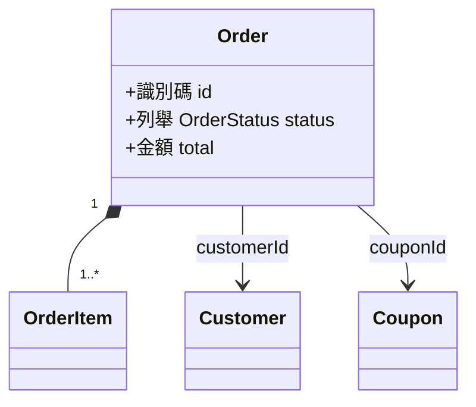

# 輸出文件模板

模型是一個目錄 `docs/domain/model/`，三種檔案。段落順序固定；沒有內容的段落寫「無」而不是刪掉。所有「來源」欄一律寫 `<規則文件 slug>/BR-XXX-nnn`。

| 檔案 | 用途 |
|---|---|
| `README.md` | 總覽：所有聚合、跨聚合關聯與 policy、完整追溯表 |
| `<聚合>.md` | 一個聚合一份，檔名為聚合根識別名的 kebab-case（`order.md`、`customer.md`） |
| `shared.md` | 兩個以上聚合共用的值物件與列舉 |

## 1. `README.md`

```markdown
# Domain Model

> 最後更新：YYYY-MM-DD ｜ 狀態：草稿 / 已確認

## 範圍
- **不涵蓋**：儲存方式、table / 欄位設計、索引、API 型別（見各規則文件「實作提示」）

## 來源規則文件
| 規則文件 | 已反映版本 | 影響的聚合 |
|---|---|---|
| `business-rules/order-dedup.md` | 2 | order、customer |
| `business-rules/coupon.md` | 1 | coupon、order |

## 模型總覽



| 聚合 | 聚合根 | 包含 | 檔案 | 守的不變量 |
|---|---|---|---|---|
| 訂單 | Order | OrderItem | `order.md` | INV-ORD-001, INV-ORD-002 |
| 客戶 | Customer | — | `customer.md` | INV-CUS-001 |

## 跨聚合關聯
<只列跨聚合的；聚合內的關聯寫在各聚合檔。格式同聚合檔的「關聯總表」>

| 關係名 | 從 → 到 | 基數 | 可變更 | 對方消失時 | 規則 | 來源 |
|---|---|---|---|---|---|---|
| 客戶下訂單 | Customer → Order | 1 → 0..* | 否 | 保留識別碼 | INV-CUS-002 | order-dedup/BR-ORD-001 |

## 跨聚合 Policy 與 Domain Service
<牽涉兩個以上聚合的 policy / service 放這裡，格式同聚合檔；只牽涉單一聚合的放該聚合檔>

## 追溯表
依規則文件分組，每份文件的每個 BR ID 都要出現。

### `business-rules/order-dedup.md`（版本 2）
| 規則 ID | 類型 | 模型元素 | 所在檔案 |
|---|---|---|---|
| BR-ORD-001 | 定義 | Order、CreateOrder | order.md |
| BR-ORD-003 | 約束 | POL-ORD-001 | order.md |

### `business-rules/coupon.md`（版本 1）
| … |

### 未對應的規則
| 規則 ID | 原因 |
|---|---|
| order-dedup/BR-ORD-012 | 純 UI 顯示規則，不影響模型 |

## 未決事項
- [ ] <跨聚合的、或使用者選擇「保留既有」而擱置的新規則>

## 變更紀錄
| 日期 | 規則文件 / 版本 | 變更 |
|---|---|---|
| YYYY-MM-DD | order-dedup v1 | 初版：新增 order、customer 聚合 |
| YYYY-MM-DD | coupon v1 | 新增 coupon 聚合；order 新增 couponId 與 INV-ORD-005 |
```

## 2. `<聚合>.md`

```markdown
# 訂單 Order

> 最後更新：YYYY-MM-DD ｜ 狀態：草稿 / 已確認

## 聚合
- **聚合根**：Order
- **包含**：OrderItem（值物件）
- **守的不變量**：INV-ORD-001, INV-ORD-002
- **別名**：「訂單單據」（coupon/領域拆解）→ 同 Order
- **來源規則文件**：order-dedup v2、coupon v1

## 列舉

### 訂單狀態 OrderStatus
| 值 | 識別名 | 說明 | 終態 | 來源 |
|---|---|---|---|---|
| 草稿 | Draft | … | 否 | order-dedup/BR-ORD-005 |

### <下一個列舉>

## 值物件
<只屬於本聚合的值物件；共用的寫在 shared.md，這裡只引用：「使用 shared.md：Money、Currency」>

### 訂單項目 OrderItem
- **定義**：…
- **屬性**：
  | 屬性 | 型別 | 說明 |
  |---|---|---|
  | productRef | ProductRef（shared） | … |
  | quantity | 整數，1..99 | … |
  | unitPrice | 金額（shared） | 成立時凍結 |
- **相等性**：三個屬性皆相同
- **不變量**：
  - INV-ORD-006 quantity 介於 1 至 99（order-dedup/BR-ORD-002）
- **運算**：subtotal = unitPrice × quantity（四捨五入到整數，order-dedup/BR-ORD-010）
- **為什麼是值物件**：兩個相同商品、數量、單價的項目沒有區別；規則裡沒有任何動作指向單一項目
- **來源**：order-dedup/BR-ORD-002, order-dedup/BR-ORD-010

### <下一個值物件>

## 實體

### 訂單 Order（聚合根）
- **定義**：…
- **身分**：識別碼 id；**為什麼是實體**：兩張內容相同的訂單是不同的訂單
- **屬性**：
  | 屬性 | 型別 | 必要 | 說明 | 來源 |
  |---|---|---|---|---|
  | id | 識別碼 | ✓ | | 推導 |
  | status | 列舉 OrderStatus | ✓ | | order-dedup/BR-ORD-005 |
  | items | 集合〈OrderItem〉有序、1..50 | ✓ | | order-dedup/BR-ORD-002 |
  | customerId | Customer 參照 | ✓ | 跨聚合 | order-dedup/BR-ORD-001 |
  | couponId | 可選〈Coupon 參照〉 | | 跨聚合；沒有值 = 未使用優惠券 | coupon/BR-CPN-003 |
  | total | 金額（衍生，成立時凍結） | ✓ | = Σ items.subtotal − discount + shipping | order-dedup/BR-ORD-010 |
- **不變量**：
  | ID | 陳述 | 檢查時機 | 例外 | 來源 |
  |---|---|---|---|---|
  | INV-ORD-001 | items 數量介於 1 至 50 | 建立、修改項目 | 無 | order-dedup/BR-ORD-002 |
  | INV-ORD-005 | 同一張訂單最多套用一張優惠券 | ApplyCoupon | 無 | coupon/BR-CPN-003 |
- **狀態機**：
  | 從 | 到 | 命令 | 前置條件 | 發出事件 | 來源 |
  |---|---|---|---|---|---|
  | 草稿 | 已送出 | 送出訂單 SubmitOrder | INV-ORD-001 | 訂單已送出 OrderSubmitted | order-dedup/BR-ORD-006 |
- **來源**：order-dedup/BR-ORD-001, order-dedup/BR-ORD-002, coupon/BR-CPN-003, …

### <聚合內其他實體>

## 關聯

本聚合出發的關聯（聚合內的與指向其他聚合的都寫；被其他聚合指向的不重複寫）。每條先寫語意（帶動詞、雙向），再寫結構與生命週期。掛在關聯上的規則另立不變量或 policy，這裡只引用 ID。

### 客戶 — 訂單
- **關係名**：客戶 **下** 訂單 ／ 訂單 **屬於** 客戶
- **從 → 到**：Customer → Order
- **基數**：1 → 0..*（一個客戶可有多張訂單；每張訂單恰有一個客戶）
- **擁有權**：無（各自獨立生命週期）
- **跨聚合**：是，Order 持有 `customerId`
- **建立時機**：命令 CreateOrder
- **可否變更**：不可，訂單成立後不得換客戶（INV-ORD-003）
- **解除時機**：不解除；客戶停用不影響既有訂單（BR-CUS-004）
- **關聯上的規則**：INV-CUS-002 同一客戶同時最多 5 張進行中訂單；POL-ORD-001 同商品重複下單檢查
- **來源**：order-dedup/BR-ORD-001, order-dedup/BR-ORD-003, order-dedup/BR-CUS-002

### 訂單 — 訂單項目
- **關係名**：訂單 **包含** 訂單項目 ／ 訂單項目 **隸屬** 訂單
- **從 → 到**：Order → OrderItem
- **基數**：1 → 1..50
- **擁有權**：Order 擁有，項目隨訂單建立與刪除
- **跨聚合**：否
- **建立時機**：CreateOrder、AddOrderItem
- **可否變更**：僅狀態為草稿時可增刪（INV-ORD-004）
- **解除時機**：隨 Order 刪除
- **關聯上的規則**：INV-ORD-001 項目數 1..50
- **來源**：order-dedup/BR-ORD-002, order-dedup/BR-ORD-007

### <下一條關聯>

### 關聯總表
| 關係名 | 從 → 到 | 基數 | 擁有權 | 跨聚合 | 可變更 | 規則 | 來源 |
|---|---|---|---|---|---|---|---|
| 客戶下訂單 | Customer → Order | 1 → 0..* | 無 | 是 | 否 | INV-CUS-002, POL-ORD-001 | order-dedup/BR-ORD-001 |
| 訂單包含項目 | Order → OrderItem | 1 → 1..50 | Order | 否 | 草稿時 | INV-ORD-001 | order-dedup/BR-ORD-002 |

## 命令
| 命令 | 對象 | 允許執行者 | 前置條件 | 結果 | 發出事件 | 失敗時 | 來源 |
|---|---|---|---|---|---|---|---|
| 建立訂單 CreateOrder | Order | 買家、客服 | INV-ORD-001, POL-ORD-001 | 新 Order（草稿） | 訂單已建立 OrderCreated | 拒絕並回傳原因 | order-dedup/BR-ORD-001, order-dedup/BR-ORD-003 |

## 領域事件
| 事件 | 發出者 | 攜帶資料 | 處理 policy | 來源 |
|---|---|---|---|---|
| 訂單已送出 OrderSubmitted | Order | orderId, customerId, total, 時間點 | POL-ORD-002 | order-dedup/BR-ORD-006 |

## Policy 與 Domain Service
<只牽涉本聚合的；跨聚合的寫在 README.md>

### POL-ORD-001 同商品重複下單檢查
- **類型**：跨聚合約束 / 事件處理 / 排程
- **觸發**：命令 CreateOrder 執行前 ／ 事件 … ／ 每日 00:00（Asia/Taipei）
- **邏輯**：…（引用規則陳述，不重寫）
- **例外**：order-dedup/BR-ORD-004 客服代下不受限
- **優先序**：…
- **失敗處理**：…
- **來源**：order-dedup/BR-ORD-003, order-dedup/BR-ORD-004

## 建模假設
| ID / 元素 | 假設 | 若不成立 | 涉及規則 |
|---|---|---|---|
| OrderItem | 為值物件而非實體 | 需改為實體並加識別碼，聚合不變 | order-dedup/BR-ORD-002, order-dedup/BR-ORD-010 |

## 與既有模型的關係
<repo 已有型別 / 模型時：沿用了哪些識別名、哪些概念既有但本模型有不同定義、衝突處理；無則寫「無既有模型」>

## 未決事項
- [ ] …

## 變更紀錄
| 日期 | 規則文件 / 版本 | 變更 |
|---|---|---|
| YYYY-MM-DD | order-dedup v1 | 初版 |
| YYYY-MM-DD | coupon v1 | 新增 couponId、INV-ORD-005、命令 ApplyCoupon |
```

## 3. `shared.md`

```markdown
# 共用值物件與列舉

> 最後更新：YYYY-MM-DD

被兩個以上聚合使用的元素。只在一個聚合用的留在該聚合檔；第二個聚合開始用時搬過來，並在原聚合檔改為引用。

## 值物件

### 金額 Money
- **定義**：…
- **屬性**：
  | 屬性 | 型別 | 說明 |
  |---|---|---|
  | amount | 小數（2 位） | … |
  | currency | 列舉 Currency | … |
- **相等性**：amount 與 currency 皆相同
- **不變量**：
  - INV-SHR-001 amount ≥ 0（order-dedup/BR-ORD-010）
- **運算**：add、multiply（四捨五入到整數，order-dedup/BR-ORD-010）
- **為什麼是值物件**：兩個 100 元沒有區別
- **使用者**：Order、Coupon
- **來源**：order-dedup/BR-ORD-010, coupon/BR-CPN-005

## 列舉

### 幣別 Currency
| 值 | 識別名 | 說明 | 來源 |
|---|---|---|---|
| 新台幣 | TWD | … | order-dedup/BR-ORD-010 |

## 變更紀錄
| 日期 | 規則文件 / 版本 | 變更 |
|---|---|---|
```

## ID 規範

- 不變量 `INV-<實體縮寫>-<三位流水號>`、policy / service `POL-<實體縮寫>-<三位流水號>`；縮寫沿用規則文件的縮寫表，共用元素用 `SHR`。多份規則文件對同一實體用了不同縮寫時，以既有模型（或先出現的文件）為準，並在該聚合檔「別名」註明
- 命令與事件不編號，用「中文名 + PascalCase 識別名」；事件用過去式（`OrderCreated`），命令用動詞原形（`CreateOrder`）
- 已存在的模型檔沿用既有 ID 與識別名，新元素接續編號；INV / POL 的流水號在整個 `docs/domain/model/` 內以縮寫為單位遞增，不按檔案重算
- 引用規則一律 `<規則文件 slug>/BR-XXX-nnn`；同一段落內全部來自同一份文件時，可在段落開頭註明「來源文件：order-dedup」後省略前綴

## 對話中的摘要格式

```
已處理規則文件：order-dedup v2、coupon v1
新增：docs/domain/model/coupon.md（Coupon 聚合）
修改：docs/domain/model/order.md（新增 couponId、INV-ORD-005、ApplyCoupon）
      docs/domain/model/shared.md（Money 新增使用者 Coupon）
      docs/domain/model/README.md（追溯表、跨聚合關聯 Order → Coupon）
模型現況：聚合 a ／ 實體 b ／ 值物件 c ／ 列舉 d ／ 關聯 e ／ 命令 f ／ 事件 g ／ 不變量 h ／ policy i
追溯：本次規則 N 條全部對應 ／ 未對應 K 條（原因見 README.md）
最值得確認的三個建模假設：
1. <元素>：… （<slug>/BR-XXX-nnn）
2. …
3. …
下一步：依模型建 type / class 與測試；schema 設計以本模型為依據。
```
